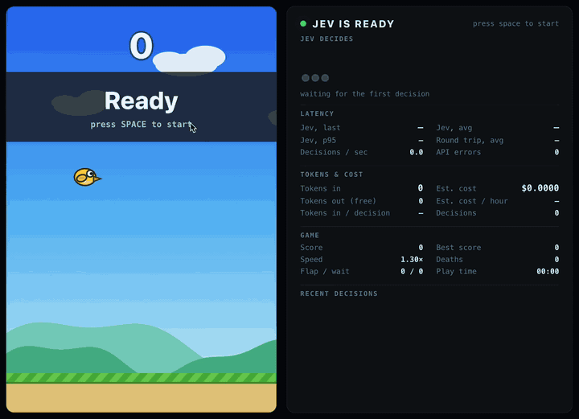

# Jev Plays Flappy Bird

A live demo of [TypeSafe](https://docs.typesafe.ai)'s **Jev** model playing Flappy Bird.



About three times a second, the game asks Jev one question: flap or wait? Jev answers, and the bird does what it says. Nothing else controls the bird. If Jev stops answering, the bird falls.

```
game state ──► local server ──► Jev picks FLAP or WAIT ──► the bird flaps once on FLAP
```

The game never waits for Jev. It keeps running while the answer is on its way.

## Setup

You need Node 20 or newer and a TypeSafe API key.

```sh
npm install
cp .env.example .env      # paste your key from https://console.typesafe.ai/keys
npm run dev               # open http://localhost:5173
```

Press **Space** to start.

Your API key stays on the local server (`server/jev.ts`). It is never sent to the browser. `.env` is git-ignored.

| Setting in `.env` | Default | What it does |
| --- | --- | --- |
| `TYPESAFE_API_KEY` | none | Required. |
| `TYPESAFE_DEFAULT_MODEL` | `jev-latest` | Pin a version, like `jev-1.13.0`, for repeatable runs. |
| `JEV_TIMEOUT_MS` | `2000` | An answer slower than this counts as an error. |

## How it works

**The question.** Jev gets one multiple-choice question with two options, `FLAP` and `WAIT`. Each option has a short description of when it applies. The question lives in `src/question.ts`. It uses TypeSafe's [Choice](https://docs.typesafe.ai/primitives/choice) question type.

**What Jev sees.** With each question, the game sends a small snapshot:

- where the bird is and how fast it is moving
- how far away the next pipe is, and where its gap starts and ends
- how much room the bird has above and below it
- the same facts in plain words, like "inside the gap, lower half" and "falling"

The snapshot only describes the scene. It never tells Jev what to do. The code that builds it is `observe()` in `src/game.ts`.

**What the app does with the answer.** It uses Jev's choice exactly as returned. There are no thresholds, no backup rules, and no retries. A retried answer would arrive too late to be useful.

**Dealing with delay.** Each answer takes about 280ms to come back. By then the bird has moved. So the game describes the scene as it will look when the answer arrives, assuming the bird is left alone. Jev still makes every decision. You can turn this off in the debug menu ("Latency lead") to see the difference.

**Why the bird floats.** The bird rises and falls more slowly than in the original game. This gives each decision time to matter when only three or four arrive per second.

## Difficulty

The game gets harder with every pipe for the first 30 pipes. Then it stays at that level. It resets when the bird dies.

As it gets harder:

- the world scrolls faster
- the pipes move closer together
- the gaps get a little smaller
- each gap sits higher or lower than the last, with less time to get there

The last one matters most. The bird's flying never changes, so less time between pipes means less room for a wasted decision. At the top level Jev will die now and then.

You can tune all of this in `START` and `END` near the top of `src/game.ts`.

## What helped Jev play well

All of these are changes to what Jev is asked or shown. None of them is code that plays the game.

- **Matching words.** The answer options use the same words as the snapshot, such as "upper half of the gap". Jev did much worse when they didn't match.
- **Say where the bird is, not what physics will do.** An early option mentioned "falling fast". Jev then flapped whenever the bird fell fast, even when it was above the gap and needed to fall.
- **Plain words next to the numbers.** Jev handles "below the gap" better than raw coordinates. You can turn the words off in the debug menu to compare.
- **Do the math in code.** The game works out the room above and below the bird, so Jev doesn't have to subtract.
- **Describe the moment the answer lands.** See "Dealing with delay" above.
- **A fair course.** Every gap can be reached from the one before it in the time available.

Before these changes Jev died every 15 to 30 seconds. With them it played for minutes without dying on the same kind of course. That is why the course now gets harder as it goes.

## The side panel

- **Latency** is measured on the local server around each call to Jev. The panel shows the last, average, and slow-end (95th percentile) values, plus the full round trip from the browser.
- **Tokens** come straight from the API response.
- **Est. cost** is worked out by the app, not reported by the API. It is input tokens × $0.042 per million, from TypeSafe's public [pricing](https://docs.typesafe.ai/models) for Jev 1.13. Output tokens are free. Check that page for current prices.
- **Play time** only counts time spent playing. Pauses don't count.
- Each decision uses about 500 input tokens. That comes to roughly a quarter of a dollar per hour of play.
- **JEV OFFLINE** appears on any error, such as a missing key, a timeout, or a rate limit. The bird gets no input until Jev is back.

## Controls

The game waits on a **Ready** screen until you press **Space**. After that, Space pauses and resumes. After a death the game restarts by itself.

Click **debug** in the bottom-right corner for more:

- how often to ask Jev
- game speed
- difficulty ramp on or off
- latency lead on or off
- plain-word descriptions on or off
- restart, reset stats, show or hide parts of the panel
- **Export JSON**

**Export JSON** downloads the full session. For every decision it includes what Jev was shown, what it chose, how sure it was, how long it took, and the tokens used. It also lists every API error and a summary.

## Project layout

```
server/jev.ts     local endpoint that calls Jev (the API key stays here)
src/question.ts   the question Jev is asked
src/game.ts       physics, pipes, collisions, drawing (no decision logic)
src/session.ts    the decision loop, stats, and export
src/App.tsx       page layout, side panel, debug menu
```

Recording tip: the game and panel sit together in the middle of the window, about 950×720. Crop to that and the debug menu stays out of frame.

## Contributing

Issues and pull requests are welcome.

`npm run build` checks types and builds the app. It needs no API key, so run it before opening a pull request. To run the game you need your own TypeSafe key in `.env`. Never commit it.

One rule: **app code must not play the game.** Changing what Jev is asked or shown is fine. Thresholds, fallbacks, or any local flap logic are not.

## License

[MIT](LICENSE)
